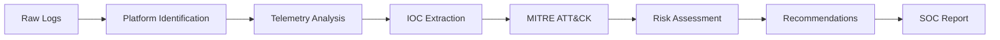

# AI-Prompt-For-SOC

# 🛡️ AI-Powered SOC Analyst Assistant

> A tool-agnostic AI prompt that helps SOC analysts analyze security logs, alerts, telemetry, and IOCs and convert them into structured SOC investigation reports.

---

## 📌 Overview

SOC analysts work with security data from different SIEM, EDR, and XDR platforms, each using different field names and terminology.

This project provides a **universal AI-powered SOC analysis prompt** that allows an analyst to simply copy raw logs and paste them into an AI assistant.

The AI then:

```text
**Raw Security Logs
       ↓
Identify Security Platform
       ↓
Analyze Telemetry
       ↓
Extract IOCs
       ↓
Map MITRE ATT&CK
       ↓
Assess Risk
       ↓
Generate SOC Investigation Report**
```

The goal is to reduce repetitive analysis and documentation while maintaining a consistent investigation methodology.

---

# 🎯 Problem Statement

Raw security alerts can contain hundreds of fields, making manual investigation time-consuming.

For example:

```text
DeviceName=WIN-CLIENT01
UserName=john.doe
ProcessName=powershell.exe
ParentProcess=winword.exe
CommandLine=powershell.exe -enc ...
RemoteIP=185.x.x.x
FileHash=<HASH>
DetectionName=Suspicious PowerShell Activity
Severity=High
```

A SOC analyst needs to determine:

* What happened?
* Which user and asset were affected?
* What process executed?
* Is the activity malicious or legitimate?
* Were network connections made?
* Are there relevant IOCs?
* Which MITRE ATT&CK techniques apply?
* What response action was taken?
* What should happen next?

This prompt standardizes these tasks into a single workflow.

---

# 🚀 Key Features

| Feature                    | Description                                                     |
| -------------------------- | --------------------------------------------------------------- |
| 🔍 Platform Identification | Identifies the likely SIEM/EDR/XDR source                       |
| 🧠 Log Analysis            | Interprets raw security telemetry                               |
| 🌳 Process Analysis        | Reviews execution and parent-child relationships                |
| 🧬 IOC Extraction          | Extracts IPs, domains, hashes, files, users, etc.               |
| 🎯 MITRE ATT&CK            | Maps supported activity to ATT&CK techniques                    |
| 🛡️ Response Analysis      | Identifies actions such as Blocked, Quarantined, Isolated, etc. |
| ⚠️ Risk Assessment         | Provides evidence-based risk evaluation                         |
| 📋 SOC Reporting           | Generates a structured investigation report                     |
| 🔄 Cross-Platform          | Uses the same framework across different security products      |

---

# 🧠 Supported Security Platforms

The prompt is designed to work with telemetry from platforms such as:

* Microsoft Sentinel
* Microsoft Defender for Endpoint
* SentinelOne
* CrowdStrike Falcon
* Palo Alto Cortex XDR
* VMware Carbon Black
* Splunk
* IBM QRadar
* Elastic Security
* Generic SIEM / EDR / XDR exports

It is **not restricted to these products**. If the platform is unfamiliar, the AI can infer field meanings from the available telemetry and clearly identify uncertain mappings.

---

# 🔍 Universal Analysis Framework

The AI analyzes whichever categories are supported by the supplied logs.

### Detection & Threat

* Detection metadata
* Alert/incident information
* Threat classification
* Severity
* Detection type

### Execution & Files

* Process creation
* Parent-child relationships
* Command lines
* File creation/modification/deletion
* Script/interpreter activity
* LOLBins

### Security Activity

* Persistence
* Credential access
* Network communication
* Identity/authentication activity
* Lateral movement
* IOC information

### Response & Classification

* Security-product response
* User vs automated activity
* MITRE ATT&CK
* Malicious / Suspicious / Benign / False Positive / User-Driven

If information is unavailable, the AI reports:

```text
Not Available
```

instead of guessing.

---

# 🔄 Investigation Workflow



---

# 📊 Generated SOC Report

The AI produces a standardized report containing:

```text
Incident Summary
        ↓
Source Platform(s)
        ↓
Technical Analysis
        ↓
IOC Details
        ↓
MITRE ATT&CK Mapping
        ↓
Risk Assessment
        ↓
Recommendations
        ↓
Final Verdict
```

### IOC Details

The report can include:

| Field               | Example                          |
| ------------------- | -------------------------------- |
| Alert/Incident Name | Suspicious PowerShell Activity   |
| Asset / Hostname    | WIN-CLIENT01                     |
| Username            | john.doe                         |
| Process             | powershell.exe                   |
| Parent Process      | winword.exe                      |
| Command Line        | Available telemetry              |
| Source IP           | Available telemetry              |
| Destination IP      | Available telemetry              |
| URL / Domain        | Available telemetry              |
| File Hash           | SHA256/MD5/SHA1                  |
| Detection Name      | Available telemetry              |
| Severity            | High                             |
| Timestamp           | Available telemetry              |
| Response Action     | Blocked / Quarantined / Isolated |

---

# 🎯 MITRE ATT&CK Mapping

Where sufficient evidence exists, the AI maps relevant tactics and techniques.

Example:

```text
Execution
 └── Command and Scripting Interpreter

Persistence
 └── Scheduled Task/Job

Credential Access
 └── OS Credential Dumping

Defense Evasion
 └── Obfuscated/Compressed Files

Command and Control
 └── Application Layer Protocol
```

Techniques should only be mapped when supported by the supplied telemetry.

---

# 💻 How to Use

## Step 1 — Copy the SOC Prompt

Copy the complete **SOC Analyst Assistant System Prompt** from this repository.

## Step 2 — Open an AI Assistant

Paste the prompt into your preferred AI assistant.

## Step 3 — Copy Your Security Logs

Copy the relevant alert or raw telemetry from your SIEM, EDR, XDR, or other security platform.

Example:

```text
Alert Name:
Suspicious PowerShell Activity

Device:
WIN-CLIENT01

User:
john.doe

Process:
powershell.exe

Parent:
winword.exe

Command Line:
powershell.exe -...

Remote IP:
x.x.x.x

Hash:
<FILE_HASH>
```

## Step 4 — Paste the Logs

Paste the logs below the prompt.

No manual restructuring is required.

## Step 5 — Review the Investigation

The AI generates a structured report containing:

```text
Incident Summary
Technical Analysis
IOC Details
MITRE ATT&CK
Risk Assessment
Recommendations
Verdict
```

---

# 🧪 Example Use Case

### Scenario

A SOC analyst receives an alert for suspicious PowerShell execution.

```text
DeviceName=WIN-CLIENT01
UserName=analyst
ParentProcess=WINWORD.EXE
ProcessName=powershell.exe
CommandLine=powershell.exe ...
DetectionName=Suspicious PowerShell Activity
Severity=High
```

The analyst pastes the telemetry into the AI assistant.

The AI can organize the investigation into:

```text
Detection
   ↓
Process Tree
   ↓
PowerShell Analysis
   ↓
Command-Line Analysis
   ↓
Network / IOC Analysis
   ↓
MITRE ATT&CK
   ↓
Risk Assessment
   ↓
Recommendations
```

---

# 🔐 Security & Privacy

Security logs may contain sensitive information. Before sending logs to an AI system or publishing examples, remove or mask:

```text
Passwords
API Keys
Access Tokens
Private Keys
Session Tokens
Credentials
Personal Information
Sensitive Customer Data
```

Example:

```text
Original:
api_key=xxxxxxxx

Safe:
api_key=<REDACTED_API_KEY>
```

**Never publish real secrets or credentials on GitHub.**

---

# ⚠️ Limitations

AI analysis depends on the quality and completeness of the supplied telemetry.

```text
Incomplete Logs
      ↓
Limited Evidence
      ↓
Limited Analysis
      ↓
Lower Confidence
```

For example:

* Missing process-tree data → limited execution analysis
* Missing network data → limited network investigation
* Missing authentication data → limited identity analysis

The AI should clearly state when information is unavailable rather than inventing evidence.

---

# 👨‍💻 Who Can Use This?

* SOC Analysts
* Security Analysts
* Incident Responders
* Threat Hunters
* Detection Engineers
* Blue Team Members
* Security Engineers
* Cybersecurity Students

---

# 💡 Use Cases

### Alert Triage

Convert raw alerts into structured investigation summaries.

### Incident Response

Organize evidence and identify potential attack activity.

### Threat Hunting

Analyze telemetry and identify potential ATT&CK techniques.

### Client Reporting

Convert technical security data into readable investigation reports.

### SOC Documentation

Standardize investigation notes and incident tickets.

### Cross-Platform Investigation

Apply the same analysis methodology across different security products.

---

# 📚 Analysis Methodology

The core methodology is:

```text
Raw Telemetry
      ↓
Identify Source
      ↓
Normalize Terminology
      ↓
Analyze Evidence
      ↓
Correlate Activity
      ↓
Extract IOCs
      ↓
Map MITRE ATT&CK
      ↓
Assess Risk
      ↓
Recommend Actions
      ↓
Generate SOC Report
```

---

# ⭐ Why Use This?

### Traditional SOC Analysis

```text
Alert
 ↓
Manual Analysis
 ↓
IOC Extraction
 ↓
MITRE Mapping
 ↓
Report Writing
```

### AI-Assisted SOC Analysis

```text
Alert / Logs
 ↓
Paste into AI
 ↓
Automated Analysis
 ↓
IOC Extraction
 ↓
MITRE Mapping
 ↓
Risk Assessment
 ↓
SOC Report
```

The purpose is **not to replace the SOC analyst**. It is to reduce repetitive investigation and documentation work so analysts can focus on validation, correlation, and response.

---

# 🔎 Technical Accuracy

The prompt follows a strict **evidence-first** approach.

It should never fabricate:

* Commands
* APIs
* Product features
* Configuration values
* URLs
* Permissions
* Error messages
* Security events
* IOCs

When information is missing:

```text
Not Available
```

When platform identification is uncertain:

```text
Platform mapping inferred from available telemetry.
```

---

# ⚠️ Disclaimer

This project is an **AI-assisted SOC investigation methodology** intended for:

* Authorized security monitoring
* Defensive security operations
* Incident response
* Threat detection
* Security research
* Lab environments

AI-generated findings must be validated against the original telemetry before taking security or business-impacting actions.

> **Copy the logs → Let AI structure the investigation → Validate the evidence → Make the final SOC decision.**
