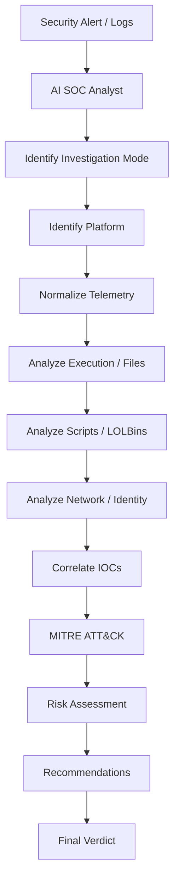
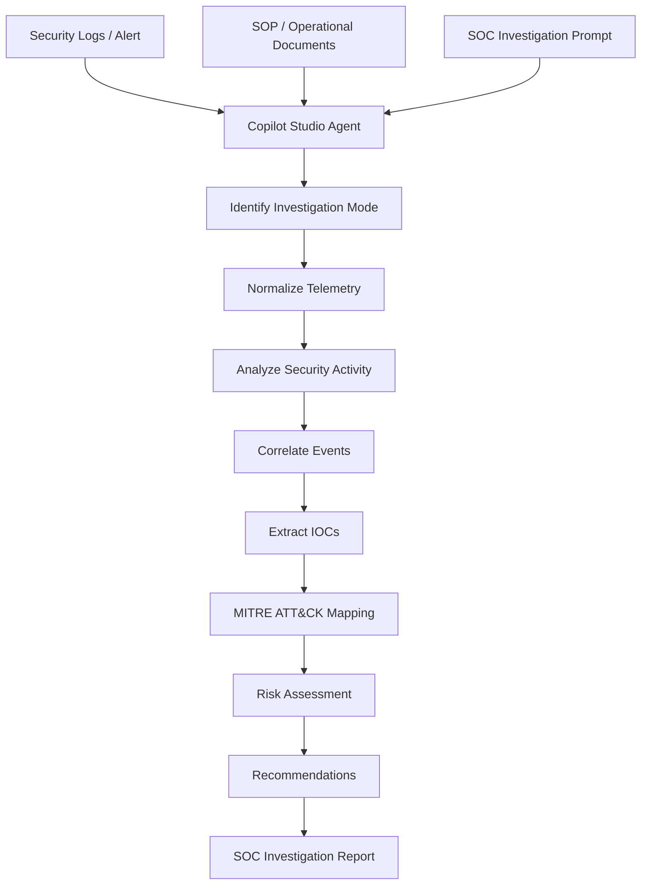

# 🛡️ AI SOC Analyst — Universal Security Log Analysis Framework

> An AI-powered SOC investigation framework for analyzing security alerts, endpoint telemetry, IOC query results, user activity, and security logs from SIEM, EDR, XDR, and other security platforms.

---

## 📌 Overview

**AI SOC Analyst** is a reusable AI prompt framework designed to help Security Operations Center (SOC) analysts analyze raw security telemetry and convert it into a structured investigation report.

Instead of manually reviewing large amounts of security logs, the framework provides a consistent methodology for:

* Alert triage
* Threat hunting
* IOC investigation
* User activity investigation
* Endpoint analysis
* Process and command-line analysis
* Network activity analysis
* Security event correlation
* MITRE ATT&CK mapping
* Risk assessment
* Investigation recommendations

The framework can be used directly with an LLM or deployed as an AI agent.

### Basic Workflow

```text
Security Alert / Logs
        ↓
AI SOC Analyst Prompt
        ↓
Investigation Mode Detection
        ↓
Telemetry Analysis
        ↓
Correlation
        ↓
IOC Extraction
        ↓
MITRE ATT&CK Mapping
        ↓
Risk Assessment
        ↓
Recommendations
        ↓
SOC Investigation Report
```

---

# 🎯 Key Capabilities

The framework helps analysts:

* Analyze individual security alerts.
* Hunt for suspicious endpoint behavior.
* Investigate IOCs across large datasets.
* Build user activity timelines.
* Correlate processes, files, users, hosts, and network activity.
* Identify suspicious process execution.
* Identify potential LOLBin usage.
* Extract relevant IOCs.
* Map observed behavior to MITRE ATT&CK.
* Assess investigation risk.
* Generate investigation recommendations.
* Produce consistent SOC investigation reports.
* Analyze single or multiple security log files.
* Use organizational SOPs and operational documents when deployed as an agent.

---

# 🔌 Supported Security Data

The framework can be used with telemetry from:

* Microsoft Sentinel
* Microsoft Defender for Endpoint
* SentinelOne
* VMware Carbon Black
* CrowdStrike Falcon
* Palo Alto Cortex XDR
* Splunk
* IBM QRadar
* Elastic Security
* Generic SIEM exports
* EDR/XDR exports
* Excel/CSV query results
* Authentication logs
* Endpoint logs
* User activity logs
* IOC query results

> The framework is designed to work with the information contained in the supplied telemetry. Product-specific capabilities should be verified against the relevant platform documentation.

---

# 🚀 Two Ways to Use This Project

There are two primary ways to use the AI SOC Analyst framework.

## Option 1 — Use the Prompt Directly With an LLM

You **do not need to create an AI agent**.

Simply copy the AI SOC Analyst prompt from this repository and paste it into your preferred compatible LLM.

Then provide your security logs or investigation data.

### Workflow

```text
Copy AI SOC Analyst Prompt
          ↓
Paste into LLM
          ↓
Upload / Paste Security Logs
          ↓
AI Analyzes Data
          ↓
Investigation Report
```

### Example

First provide the prompt:

```text
[AI SOC Analyst Prompt]
```

Then provide your logs:

```text
========== SECURITY LOGS ==========

[Paste or upload security logs]
```

Then ask the LLM what you want to investigate.

For example:

```text
Analyze these logs and identify suspicious activity.
```

or:

```text
Investigate this incident and generate a complete SOC investigation report.
```

or:

```text
Analyze these IOC results and identify affected hosts,
users, processes, and common patterns.
```

### When to Use the Direct Prompt

This approach is useful when:

* You want to quickly test the framework.
* You are experimenting with different LLMs.
* You only need the analysis occasionally.
* You do not want to configure an AI agent.
* You want to compare different LLM implementations.
* You are developing or modifying the investigation prompt.

---

# 🤖 Option 2 — Create an AI SOC Analyst Agent

If you use the framework repeatedly, you can create an AI agent and configure the SOC Analyst prompt as the agent's instructions.

This avoids repeatedly pasting the complete prompt.

You can also provide relevant:

* SOPs
* Operational documents
* Investigation procedures
* Escalation procedures
* Security guidelines
* Incident-response documentation

The agent can use these documents as additional context when performing investigations, subject to the capabilities and configuration of the chosen agent platform.

### Agent Workflow

```text
AI SOC Analyst Prompt
          +
SOPs / Operational Documents
          +
Agent Configuration
          ↓
    AI SOC Analyst Agent
          ↓
    Upload Security Logs
          ↓
      Investigation
          ↓
 Structured SOC Report
```

---

# ⚖️ Prompt vs Agent

| Feature                     | Direct Prompt                    | AI Agent                               |
| --------------------------- | -------------------------------- | -------------------------------------- |
| Setup required              | Minimal                          | Agent configuration required           |
| Paste prompt every time     | Yes                              | No                                     |
| Upload logs                 | Yes                              | Yes                                    |
| Single-log investigation    | Yes                              | Yes                                    |
| Multiple-log investigation  | Yes                              | Yes                                    |
| SOP integration             | Manually provide where supported | Can be configured as knowledge/context |
| Reusable configuration      | Limited                          | Yes                                    |
| Experimentation             | Yes                              | Yes                                    |
| Repeated SOC investigations | Useful                           | Well suited                            |
| Custom agent behavior       | Prompt-based                     | Agent configuration + prompt           |
| Best for                    | Testing and occasional analysis  | Repeated operational workflows         |

> Exact file-upload, knowledge-source, model, and context capabilities depend on the LLM or agent platform being used.

---

# 🧠 Investigation Modes

The AI determines the appropriate investigation mode from the supplied data.

If the user explicitly specifies a mode, that mode takes priority.

---

## Mode A — Alert / Incident Triage

Used for a single alert, detection, or incident.

### Objective

Reconstruct the event:

```text
Initial Trigger
      ↓
Execution
      ↓
Follow-on Activity
      ↓
Security Response
      ↓
Risk Assessment
```

The alert is treated as the anchor event.

---

# Mode B — Threat Hunting — Endpoint

Used for raw endpoint telemetry without a seed alert.

The AI should not automatically assume malicious activity.

It establishes an implicit baseline and identifies deviations such as:

* Unusual process ancestry
* Rare LOLBin usage
* Off-hours execution
* Unexpected script paths
* Unfamiliar network destinations
* Abnormal user activity

Findings are ranked:

```text
High
Medium
Low
```

If no suspicious activity is identified, the AI should clearly state that.

---

# Mode C — IOC Pivot / Bulk Query Review

Used for Excel, CSV, or other tabular IOC query results.

The AI should **aggregate the data instead of narrating rows individually**.

Analysis includes:

* Affected hosts
* Users
* Processes
* Destinations
* First-seen timestamp
* Last-seen timestamp
* Frequency
* Scope
* Common patterns
* Outliers

### Example

Instead of:

```text
Row 1 → HOST-01
Row 2 → HOST-02
Row 3 → HOST-03
...
```

Generate:

```text
IOC X was observed across 14 hosts.

12 hosts followed the same activity pattern.

2 hosts deviated from the majority pattern
and require additional investigation.
```

---

# Mode D — User Activity Investigation

Used for telemetry associated with a specific user.

The AI builds a chronological timeline and identifies:

* Authentication activity
* Devices
* Locations
* Access times
* Privilege changes
* File activity
* Network activity
* Authentication anomalies
* Unusual behavior

The investigation includes an overall behavioral risk rating based on the available evidence.

---

# 🔍 Universal Analysis Framework

The AI analyzes the available telemetry using the following categories.

## Detection Metadata

* Alert/incident name
* Detection name
* Severity
* Timestamp
* Security product

## Threat & Execution

* Threat classification
* Process
* Parent/child processes
* Process ancestry
* Execution path
* Command line

## File & Script Activity

* File name/path
* File creation/modification/execution
* Hashes
* Scripts/interpreters
* PowerShell
* Command Prompt
* Other scripting engines

## LOLBins

Identify potential Living-off-the-Land Binary usage and correlate it with the surrounding execution context.

## Persistence

Look for available evidence involving:

* Registry
* Scheduled tasks
* Services
* Startup mechanisms
* Other persistence techniques

## Credential Access

Identify available indicators involving:

* Credential dumping
* Authentication abuse
* Tokens/sessions
* Privilege escalation

## Network Communication

Analyze:

* Source IP
* Destination IP
* Domain
* URL
* Port/protocol
* Connection frequency
* Responsible process

## Identity & Lateral Movement

Analyze:

* User activity
* Authentication events
* Privilege changes
* Remote access
* Remote execution
* Cross-host activity

## IOC Reputation

Analyze available:

* File hashes
* IP addresses
* Domains
* URLs
* File/process names

Distinguish between an **observed IOC** and a **confirmed malicious IOC**.

## Security Product Response

Identify whether the security product:

* Blocked
* Quarantined
* Killed
* Isolated
* Contained
* Rolled back
* Remediated
* Took no action
* Generated an alert only

## Activity Classification

Classify the overall activity as:

* Malicious
* Suspicious
* Benign
* False Positive
* User-Driven Activity

Unavailable information must be reported as:

```text
Not Available
```

---

# 🎯 MITRE ATT&CK Mapping

Map observed behavior to relevant MITRE ATT&CK tactics and techniques.

Example:

```text
T1059.001 — PowerShell
T1027     — Obfuscated/Compressed Files and Information
```

Do not assign a technique solely because a keyword appears in the telemetry.

The mapping must be supported by observed behavior.

---

# 📋 Standard Investigation Output

Every investigation should follow this structure:

```text
Investigation Mode:

Incident Summary:

Source Platform(s) Identified:

Technical Analysis:

IOC Details:

MITRE ATT&CK Mapping:

Risk Assessment:

Recommendations:

Verdict:
```

The **Technical Analysis** section should use the Universal Analysis Framework and, where applicable, include the aggregation, baseline, or timeline required by the investigation mode.

---

# 🧾 IOC Details

Extract the following information where available:

| Field                    | Value |
| ------------------------ | ----- |
| Alert/Incident Name      |       |
| Asset / Hostname(s)      |       |
| Username(s)              |       |
| File Name / Path         |       |
| Process / Parent Process |       |
| Command Line             |       |
| Source IP                |       |
| Destination IP           |       |
| URL / Domain             |       |
| Registry Key             |       |
| File Hash                |       |
| Detection Name           |       |
| Severity                 |       |
| Timestamp / Time Range   |       |
| Security Product(s)      |       |
| Response Action          |       |
| Scope                    |       |

Use:

```text
Not Available
```

when the telemetry does not contain the requested information.

---

# 🧪 Investigation Example

## Input

```text
Alert:
Suspicious PowerShell Activity

Host:
WIN-CLIENT-01

User:
user01

Process:
powershell.exe

Parent Process:
WINWORD.EXE

Command Line:
powershell.exe -ExecutionPolicy Bypass ...

Destination:
185.x.x.x

Timestamp:
2026-09-01 10:30:00
```

## AI Investigation

```text
Investigation Mode:
A — Alert / Incident Triage

Incident Summary:
Suspicious PowerShell activity was observed on
WIN-CLIENT-01 under user01.

PowerShell was launched by WINWORD.EXE and used
ExecutionPolicy Bypass. Associated network
communication was also observed.

Source Platform:
Not Available.

Technical Analysis:
- PowerShell execution observed.
- Office application was the parent process.
- Execution policy bypass was used.
- Network communication was associated with the activity.
- Persistence: Not Available.
- Credential Access: Not Available.
- Security Response: Not Available.

MITRE ATT&CK:
T1059.001 — PowerShell

Risk Assessment:
High

Recommendations:
1. Retrieve the complete PowerShell command.
2. Investigate the originating Word document.
3. Review the destination IP.
4. Search for related activity on other endpoints.
5. Check for persistence.
6. Review the user's recent activity.

Verdict:
Suspicious
```

> This example is illustrative. Actual findings must be based on the telemetry supplied during an investigation.

---

# 📈 Investigation Workflow



---

# 🚀 How to Use the Prompt

## Step 1 — Copy the Prompt

Copy the complete **AI SOC Analyst prompt** from this repository.

## Step 2 — Collect Security Data

Collect the relevant information from:

* SIEM
* EDR
* XDR
* Threat-hunting queries
* IOC searches
* Authentication logs
* Endpoint telemetry
* Excel/CSV exports

## Step 3 — Paste the Prompt Into Your LLM

Paste the prompt followed by the security telemetry.

Example:

```text
[AI SOC Analyst Prompt]

========== LOGS / DATA ==========

[Paste your logs here]
```

## Step 4 — Review the Generated Report

The AI will identify the appropriate investigation mode and generate the structured output.

## Step 5 — Validate the Findings

Always verify important findings against the original security platform before taking containment or remediation actions.

---

# 🤖 Create an AI SOC Analyst Agent Using Microsoft Copilot Studio

The AI SOC Analyst prompt can also be implemented as an **AI agent using Microsoft Copilot Studio**.

Instead of manually pasting the prompt into an AI chat every time, you can create an agent that uses:

```text
SOC Investigation Prompt
        +
SOPs
        +
Operational Documents
        +
Agent Configuration
```

The agent can then be used to analyze security logs and generate structured investigation responses.

---

# 🏗️ Copilot Studio Workflow

```text
                    ┌──────────────────────┐
                    │ Microsoft Copilot    │
                    │ Studio                │
                    └──────────┬───────────┘
                               │
                               ▼
                    ┌──────────────────────┐
                    │ Create an Agent       │
                    │ using a Prompt        │
                    └──────────┬───────────┘
                               │
                    ┌──────────▼───────────┐
                    │ Add SOP / Operational│
                    │ Documents             │
                    └──────────┬───────────┘
                               │
                               ▼
                    ┌──────────────────────┐
                    │ AI SOC Analyst Agent  │
                    └──────────┬───────────┘
                               │
                 ┌─────────────┴─────────────┐
                 │                           │
                 ▼                           ▼
          Single Log/File              Multiple Logs/Files
                 │                           │
                 └─────────────┬─────────────┘
                               ▼
                    ┌──────────────────────┐
                    │ Log Analysis &       │
                    │ Correlation          │
                    └──────────┬───────────┘
                               │
                               ▼
                    ┌──────────────────────┐
                    │ Investigation Report │
                    │ + MITRE ATT&CK       │
                    │ + Risk Assessment    │
                    │ + Recommendations    │
                    └──────────────────────┘
```

---

# 🚀 How to Create the Agent

## Step 1 — Open Microsoft Copilot Studio

Open the Microsoft Copilot Studio portal and sign in.

Navigate to the agent creation interface.

> 📷 **Recommended screenshot:** Copilot Studio home page showing the agent creation option.

---

## Step 2 — Create a New Agent

Select:

```text
Create an agent
```

Copilot Studio will provide an interface where you can describe the agent you want to create.

---

# Step 3 — Provide the Agent Instructions

Paste the AI SOC Analyst prompt into the agent creation interface.

The prompt defines how the agent should analyze security telemetry.

The agent can be instructed to:

* Identify investigation mode.
* Analyze security logs.
* Correlate events.
* Identify suspicious behavior.
* Extract IOCs.
* Analyze processes and command lines.
* Analyze network activity.
* Map relevant activity to MITRE ATT&CK.
* Assess risk.
* Generate recommendations.
* Produce a structured SOC investigation report.

---

# 📚 Step 4 — Add SOPs and Operational Documents

You can provide relevant organizational documentation to the agent where supported.

Examples:

```text
SOP/
├── Incident_Response_SOP.pdf
├── Malware_Investigation_SOP.pdf
├── Phishing_Investigation_SOP.pdf
├── Endpoint_Investigation_SOP.pdf
├── IOC_Investigation_SOP.pdf
└── Escalation_Procedure.pdf
```

These documents can provide additional operational context.

For example, an SOP may define:

* Investigation procedures
* Escalation criteria
* Severity handling
* Evidence collection
* Containment procedures
* Incident classification
* Reporting requirements

> ⚠️ Only upload documents that you are authorized to use with the agent.

---

# ⚙️ Step 5 — Configure Agent Behavior

A simplified instruction structure can be:

```text
You are an AI SOC Analyst.

Analyze the security telemetry provided by the user.

First determine the appropriate investigation mode.

Then:

1. Identify the security platform.
2. Normalize the available telemetry.
3. Analyze processes and execution.
4. Analyze files and scripts.
5. Identify LOLBin activity.
6. Analyze persistence indicators.
7. Analyze credential-access indicators.
8. Analyze network communication.
9. Analyze identity and lateral-movement activity.
10. Extract available IOCs.
11. Correlate related events.
12. Map supported behavior to MITRE ATT&CK.
13. Assess risk.
14. Provide recommendations.
15. Generate a structured SOC investigation report.

Do not invent information.

If information is unavailable, report:

Not Available
```

This instruction can be customized according to the organization's investigation requirements.

---

# 📂 Step 6 — Upload Security Logs

Provide the security telemetry that needs to be investigated.

Depending on the platform and configured capabilities, this can include:

* Individual log files
* Multiple related log files
* SIEM exports
* EDR telemetry
* XDR data
* IOC query results
* CSV files
* Excel files
* Authentication logs
* Endpoint activity
* User activity logs

---

# 📄 Single Log Investigation

```text
Upload Log
     ↓
Agent Reads Telemetry
     ↓
Identify Investigation Mode
     ↓
Analyze Activity
     ↓
Extract IOCs
     ↓
MITRE ATT&CK Mapping
     ↓
Risk Assessment
     ↓
Investigation Report
```

---

# 📑 Bulk Log Investigation

```text
Multiple Logs
      ↓
Agent Processes Available Data
      ↓
Normalize Telemetry
      ↓
Correlate Events
      ↓
Identify Common Patterns
      ↓
Identify Outliers
      ↓
IOC Analysis
      ↓
Risk Assessment
      ↓
Investigation Report
```

Bulk investigation is particularly useful for IOC query exports and larger datasets.

---

# 💬 Step 7 — Interact With the Agent

You can upload the relevant data and ask the agent what you want to investigate.

Examples:

```text
Analyze these logs and identify suspicious activity.
```

```text
Investigate this incident and provide a SOC investigation report.
```

```text
Look for suspicious PowerShell activity.
```

```text
Analyze these IOC results and identify affected hosts.
```

```text
Build a timeline of the user's activity.
```

```text
Identify possible MITRE ATT&CK techniques.
```

```text
Identify what additional investigation steps are required.
```

---

# 🔍 Agent Investigation Example

### Input

```text
Alert:
Suspicious PowerShell Activity

Host:
WIN-CLIENT-01

User:
user01

Process:
powershell.exe

Parent Process:
WINWORD.EXE

Command Line:
powershell.exe -ExecutionPolicy Bypass ...

Destination:
185.x.x.x
```

### Agent Processing

```text
Security Log
     ↓
Investigation Mode Detection
     ↓
Process Analysis
     ↓
PowerShell Analysis
     ↓
Parent/Child Relationship
     ↓
Network Analysis
     ↓
IOC Extraction
     ↓
MITRE ATT&CK Mapping
     ↓
Risk Assessment
     ↓
Recommendations
```

---

# 🔄 Agent Investigation Architecture



---

# 🎯 What the Agent Provides

The resulting agent provides an **AI-assisted SOC investigation interface**.

Instead of repeatedly providing the entire investigation methodology:

```text
SOC Analyst
    ↓
Upload Logs
    ↓
Ask Investigation Question
    ↓
AI SOC Agent
    ↓
Investigation Report
```

The agent can use its configured instructions and available operational documentation to provide a consistent investigation workflow.

---

# 🧪 Recommended Testing

Before using the agent operationally, test it with controlled examples.

## Test 1 — Benign Activity

Provide normal endpoint activity and verify that the agent does not automatically classify it as malicious.

## Test 2 — Suspicious Activity

Provide a controlled security investigation example and verify that the relevant indicators are identified.

## Test 3 — Multiple Logs

Upload multiple related files and verify that the agent correlates available information.

## Test 4 — Missing Information

Remove important fields and verify that the agent reports:

```text
Not Available
```

instead of inventing information.

## Test 5 — SOP Validation

Provide an investigation scenario covered by your SOP and verify that the agent's workflow follows the documented procedure.

---

# 🔐 Security & Privacy

Before submitting telemetry to an AI system, review the data for sensitive information.

Redact where appropriate:

```text
Passwords
API Keys
Access Tokens
Private Keys
Cloud Credentials
Session Tokens
Sensitive Personal Information
```

Example:

```text
Authorization: Bearer <REDACTED>
```

> ⚠️ Never intentionally publish real credentials, tokens, secrets, or confidential incident information to GitHub.

---

# ⚠️ Technical Accuracy & Limitations

The framework follows a **no-hallucination principle**.

Do not invent:

* Commands
* APIs
* Features
* URLs
* Permissions
* Architecture
* Configuration
* Error messages
* Security-product capabilities

If information is unavailable:

```text
Not Available
```

For product-specific implementation or current technical details, prefer:

1. Official vendor documentation
2. Official GitHub repository
3. Official API documentation

---

# 🛡️ Analyst Validation

AI-generated analysis should be treated as **analyst assistance**, not definitive evidence.

Always validate important findings against:

* Original telemetry
* SIEM
* EDR/XDR
* Threat intelligence
* Endpoint data
* Organizational SOPs
* Other relevant security tools

Do not take destructive response actions solely from an AI-generated verdict.

---

# 🛡️ Best Practices

* Use authorized security data only.
* Sanitize sensitive information.
* Never expose credentials.
* Validate AI-generated findings.
* Preserve original telemetry for investigation.
* Correlate findings with SIEM/EDR/XDR data.
* Use threat intelligence where appropriate.
* Document the evidence supporting the final classification.
* Follow organizational incident-response procedures.
* Apply least privilege when configuring integrations.
* Protect agent credentials and API keys.
* Review access to uploaded operational documents.

---

# 💡 Real-World Use Cases

## 1. Alert Triage

Quickly turn a raw security alert into an investigation summary.

## 2. Threat Hunting

Identify unusual endpoint behavior without relying on a predefined alert.

## 3. IOC Investigation

Analyze large IOC query exports and identify affected systems and outliers.

## 4. User Investigation

Build a timeline of authentication and endpoint activity.

## 5. Incident Documentation

Convert technical investigation findings into consistent SOC case documentation.

## 6. AI-Assisted SOC Workflow

Provide analysts with a reusable investigation methodology through an LLM or AI agent.

---

# 🔗 Potential Integrations

Depending on the environment and platform capabilities, the framework can potentially be extended with:

* SIEM
* EDR/XDR
* Threat intelligence
* SOAR
* Ticketing systems
* Cloud platforms
* IAM
* Security APIs
* Collaboration platforms
* Security dashboards
* Incident-response workflows

> Verify each integration against the actual capabilities and supported APIs of the platform being used.

---

# 📚 Quick Command / Usage Reference

The framework itself is primarily prompt-driven, so usage depends on the LLM or agent platform.

Basic workflow:

```text
1. Load the AI SOC Analyst prompt
2. Provide security telemetry
3. Specify the investigation objective
4. Review the generated investigation
5. Validate findings
6. Document the evidence
7. Perform authorized response actions according to organizational procedures
```

---

# 📁 Recommended Repository Structure

```text
ai-soc-analyst/
│
├── README.md
│
├── prompts/
│   └── soc-analyst-assistant.md
│
├── examples/
│   ├── alert-triage.md
│   ├── threat-hunting.md
│   ├── ioc-investigation.md
│   └── user-investigation.md
│
├── images/
│   ├── investigation-workflow.png
│   ├── architecture.png
│   ├── copilot-studio-agent.png
│   ├── copilot-configuration.png
│   └── sample-output.png
│
├── docs/
│   ├── investigation-modes.md
│   ├── mitre-mapping.md
│   ├── copilot-studio.md
│   └── best-practices.md
│
├── config/
│   └── example.env
│
├── scripts/
│   └── setup.sh
│
└── LICENSE
```

---

# 🖼️ Recommended Documentation Images

To make the GitHub project easier to understand, consider adding screenshots/diagrams for:

### Architecture

```text
images/architecture.png
```

### Investigation Workflow

```text
images/investigation-workflow.png
```

### Direct LLM Usage

```text
images/direct-llm-usage.png
```

### Copilot Studio Agent Creation

```text
images/copilot-studio-agent.png
```

### SOP Upload

```text
images/copilot-sop-upload.png
```

### Log Upload

```text
images/log-upload.png
```

### Generated Investigation

```text
images/sample-output.png
```

Example Markdown:

```markdown

```

---

# 🤝 Contributing

Contributions are welcome.

You can contribute:

* Investigation examples
* Detection-analysis improvements
* New investigation modes
* SIEM/EDR/XDR examples
* MITRE ATT&CK mappings
* Prompt improvements
* Documentation improvements
* Agent implementation examples
* New operational workflows

Do not submit:

* Real credentials
* Confidential incident information
* Sensitive customer data
* Private security logs
* API keys or access tokens

---

# ⚖️ Disclaimer

This project is an **AI-assisted SOC investigation framework**.

It does not guarantee that an activity is malicious, benign, or a false positive.

Analysts should validate AI-generated findings against:

* Original telemetry
* Security tools
* Threat intelligence
* Organizational investigation procedures
* Relevant SOPs

Use this framework only with data you are authorized to analyze.

---

# 🎯 Project Goal

The goal of this project is to provide SOC analysts with a consistent methodology for turning raw security telemetry into actionable investigation intelligence.

```text
Raw Security Data
       ↓
AI Analysis
       ↓
Correlation
       ↓
MITRE ATT&CK
       ↓
Risk Assessment
       ↓
Recommendations
       ↓
SOC Verdict
```

The framework can be used in two ways:

```text
                 AI SOC Analyst
                       │
             ┌─────────┴─────────┐
             │                   │
             ▼                   ▼
      Direct Prompt          AI Agent
             │                   │
             ▼                   ▼
            LLM            Configured Agent
             │                   │
             └─────────┬─────────┘
                       ▼
                  Security Logs
                       ↓
                  AI Analysis
                       ↓
              SOC Investigation
```

---

# ⭐ Project Summary

> **Copy the logs → Provide the investigation prompt → Analyze → Correlate → Validate → Investigate faster**

The project is designed to make AI-assisted security investigation **repeatable, structured, and easier to operationalize**, whether you use a simple LLM prompt or deploy the methodology through an AI agent.
